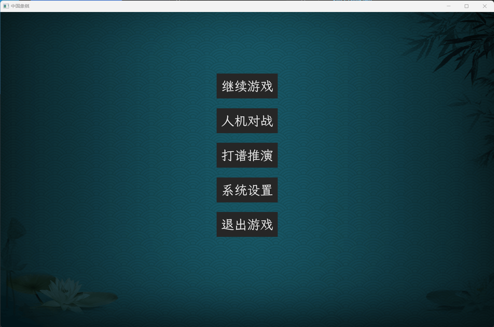
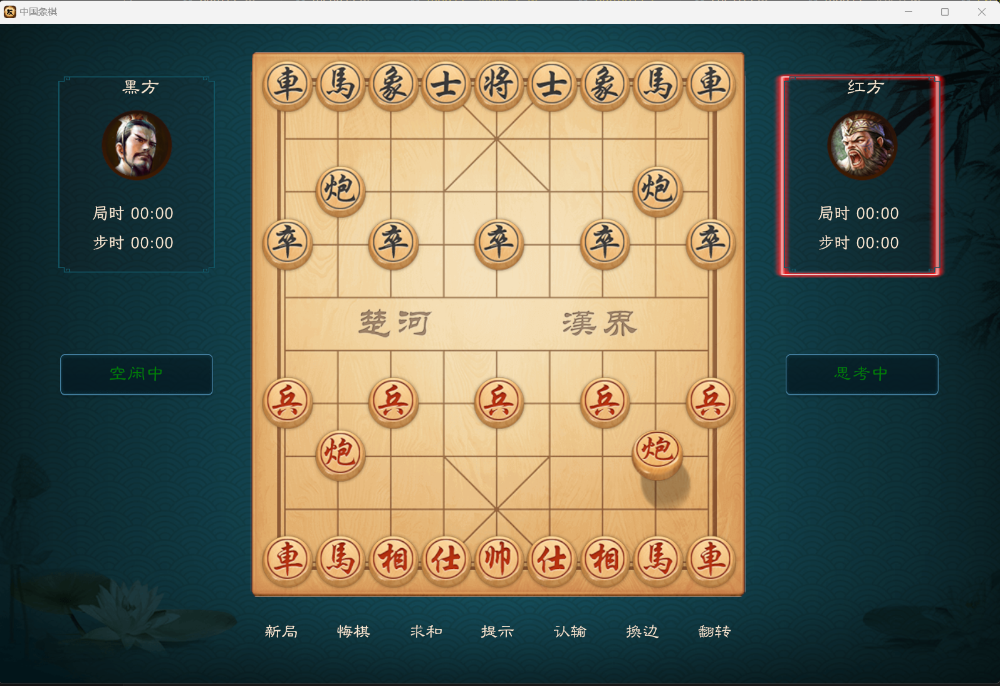

# todo list

1. 由于刚学习使用bevy框架，代码结构比较乱，先探索功能，后期整理代码
2. 系统设置菜单，分辨率、刷新率、声音、音效等
3. 目前资源位置是绝对定位，无法适配各种系统，优化屏幕缩放
4. 联机对弈待实现，计划使用`Peer to Peer`建立连接，无中心服务器

# 游戏截图

# 参考

象棋规范协议: https://www.xqbase.com/protocol.htm