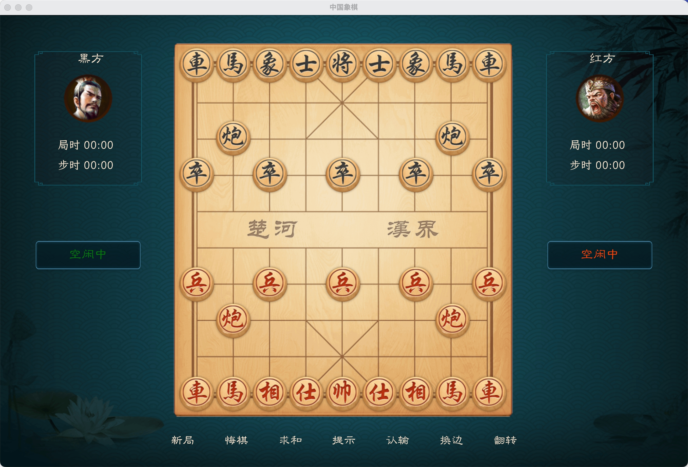

# 特性
- 优雅的背景和棋盘，简约而不简单的交互
- 跨平台，理论上支持web/darwin/linux/windows/android/ios(移动端未测试)
- 快速的AI引擎, 棋力等同于天天象棋人机, 但更快
- 高性能, 得益于rust优秀的特性，以最低的资源占用实现强大的渲染和引擎计算

# 游戏截图

### game main menu

### windows game

##### macos game

<!--  -->
<!--  -->

# develop

### todo list

1. 由于刚学习使用bevy框架，代码结构比较乱，先探索功能，后期整理代码
2. 系统设置菜单，分辨率、刷新率、声音、音效等
3. ~~目前资源位置是绝对定位，无法适配各种系统，优化屏幕缩放~~
4. 联机对弈待实现，计划使用`Peer to Peer`建立连接，无中心服务器

### 计算鼠标选择的点是否在棋子范围内
- a: 鼠标选择点
- b: 棋子圆心
- r: 棋子半径

$$ \sqrt {\left | {ax-bx} \right |^{2}+\left | {xy-by} \right |^{2}} \ > \ r $$

# 参考资料

象棋规范协议: https://www.xqbase.com/protocol.htm
象棋AI算法：https://www.xqbase.com/computer/outline.htm
